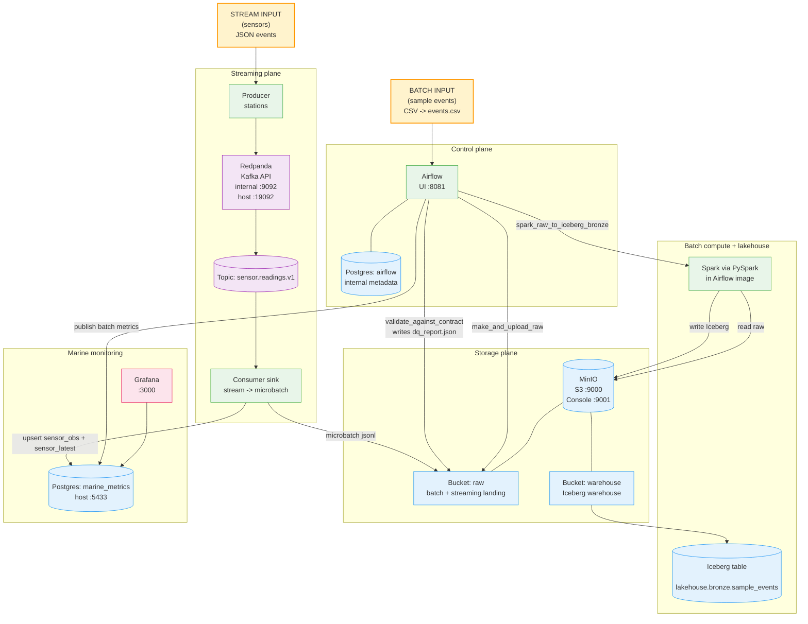
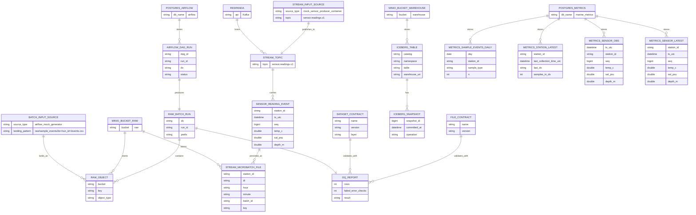

## TL;DR

I built a **local-first** marine biology data platform prototype that mirrors a cloud-style architecture, but runs entirely on one machine using **Podman Compose**. It supports:

- **Batch ingestion** (Airflow manual runs) with **dataset contracts + DQ gate**
- **Lakehouse Bronze tables** using **Apache Iceberg** (stored in MinIO)
- **Marine monitoring dashboards** using **Grafana** backed by a **metrics Postgres**
- **Streaming ingestion** using **Redpanda (Kafka API)** with **micro-batch landing** into object storage + metrics upserts

This is an MVP that is explicitly designed to be **modular**: components can be swapped for cloud equivalents later with minimal changes.

---

## Design goals

### 1) Local-first, cloud-later

Everything runs locally first; the architecture mirrors cloud patterns:

- object storage (MinIO ~ S3)
- orchestration (Airflow)
- compute (Spark)
- table format (Iceberg)
- streaming bus (Redpanda ~ Kafka)
- monitoring dashboards (Grafana)

### 2) Modular boundaries

Each capability is a replaceable “module”:

- storage boundary: S3 API
- compute boundary: Spark jobs
- metadata boundary: Iceberg table metadata
- streaming boundary: Kafka protocol
- monitoring boundary: SQL metrics mart

### 3) Data quality as a gate

A dataset contract blocks downstream writes if checks fail (fail-fast).

### 4) Avoid anti-patterns

- Airflow is **not** used as a streaming runtime (no long-running streaming tasks in Airflow).
- Object storage is not used as “one event = one file”; streaming uses **micro-batch landing** to avoid small-files hell.

---

## What’s running (the stack)

### Core platform (batch + storage)

- **Airflow 2.9.3** (webserver + scheduler; LocalExecutor)
- **Postgres (airflow)**: Airflow operational metadata DB
- **MinIO**: S3-compatible object store for all zones + Iceberg warehouse
- **Spark** (local via PySpark inside Airflow image): batch transforms + writes
- **Apache Iceberg**: table format for Bronze tables stored in MinIO

### Marine monitoring

- **Postgres (metrics-db)**: domain monitoring “metrics mart”
- **Grafana**: dashboards querying metrics-db

### Streaming system

- **Redpanda**: Kafka-compatible broker
- **Redpanda Console**: UI to inspect topics
- **Streaming producer**:  marine sensors (temp, salinity, depth)
- **Streaming consumer sink**:
  - consumes Kafka topic continuously (streaming)
  - writes **micro-batch JSONL** files to MinIO
  - upserts **sensor_obs** + **sensor_latest** into metrics-db

---

## Storage map (explicit: what lives where)

### Databases

#### 1) Airflow metadata DB (Postgres)

- **DB:** `airflow`
- **Purpose:** orchestration state only (DAG runs, task instances, logs metadata)
- **Not used for scientific data**

#### 2) Marine metrics DB (Postgres)

- **DB:** `marine_metrics`
- **Purpose:** SQL-friendly tables for Grafana (marine monitoring, not platform performance)
- Tables:
  - `sample_events_daily` (batch-derived)
  - `station_latest` (batch-derived)
  - `sensor_obs` (streaming time-series)
  - `sensor_latest` (streaming latest per station)

### Object storage (MinIO)

#### Bucket: `raw`

- Batch raw landing (per Airflow run):
  - `raw/sample_events/ds=<ds>/run_id=<run_id>/events.csv`
  - `raw/sample_events/ds=<ds>/run_id=<run_id>/manifest.json`
  - `raw/sample_events/ds=<ds>/run_id=<run_id>/dq_report.json`
- Streaming landing (micro-batches):
  - `raw/stream/sensor_readings/station_id=<id>/dt=YYYY-MM-DD/hour=HH/minute=MM/batch_id=<uuid>/data.jsonl`

#### Bucket: `warehouse`

- Iceberg warehouse:
  - `warehouse/iceberg/bronze/sample_events/...`
    - `metadata/` (Iceberg metadata JSON, snapshots)
    - manifests / manifest-lists
    - data files (Parquet)

---

## Port & access map

### Web UIs (from host)

- Airflow: `http://localhost:8081`
- MinIO API: `http://localhost:9000`
- MinIO Console: `http://localhost:9001`
- Grafana: `http://localhost:3000`
- Redpanda Console: `http://localhost:8089`

### Databases (from host)

- Metrics DB: `localhost:5433` → `marine_metrics`

Airflow Postgres is internal-only unless explicitly exposed (optional mapping `5434:5432`).

### Internal service DNS (inside compose network)

- MinIO: `http://minio:9000`
- Redpanda broker: `redpanda:9092`
- Metrics DB: `metrics-db:5432`
- Airflow DB: `postgres-airflow:5432`

---

## Batch MVP: Raw → Contract validation → Iceberg Bronze

### Batch mode characteristics

- **Type:** batch
- **Trigger:** manual only (`schedule=None`)
- **Semantics:** bounded job run; produces a run-specific raw prefix + appends Bronze table

### DAG (conceptual)

1) **make_and_upload_raw**
   - generates  dataset (CSV)
   - writes to MinIO raw bucket (run-scoped folder)
2) **validate_against_contract**
   - applies `FileContract` + `DatasetContract`
   - writes `dq_report.json`
   - fails fast on `severity=error`
3) **spark_raw_to_iceberg_bronze**
   - reads raw CSV via `s3a://`
   - casts types, adds derived fields (e.g., `ds`, `ingest_ts`)
   - appends to Iceberg Bronze table

### Important nuance: where Bronze is stored

“Bronze zone” logically exists, but physically it’s an Iceberg table stored under the **warehouse** bucket:

- `lakehouse.bronze.sample_events` → `warehouse/iceberg/bronze/sample_events/...`

---

## Dataset contracts (DQ gate)

I introduced a simple but powerful contract pattern:

### FileContract (raw)

Validates file shape:

- required columns exist
- optional columns allowed
- basic expectations before processing

### DatasetContract (bronze)

Validates dataset-level rules:

- column typing expectations
- value constraints
- format checks
- “severity” levels (warn vs error)

**DQ gate behavior**

- if any `severity=error` check fails → pipeline halts before Iceberg write
- a `dq_report.json` is written to the raw run folder as an artifact

---

## Streaming MVP: Kafka transport + micro-batch landing

### Streaming vs micro-batch (clarification)

- **Transport is streaming:** producer emits events continuously → consumer reads continuously with offsets.
- **Landing is micro-batch:** consumer buffers (e.g. 10s) then writes one object file per micro-batch to MinIO.

This avoids small-file explosion while remaining near-real-time.

### Streaming topic

- `sensor.readings.v1`

### Example streaming event

```json
{
  "station_id": "ST-ONAGAWA-01",
  "ts_utc": "2026-02-12T07:10:00Z",
  "seq": 42,
  "temp_c": 12.34,
  "sal_psu": 33.80,
  "depth_m": 1.5,
  "qc_flag": "ok",
  "source": ""
}
````

### Streaming outputs

1. **Durable landing to MinIO** (micro-batch JSONL):

- `raw/stream/sensor_readings/station_id=.../dt=.../hour=.../minute=.../batch_id=.../data.jsonl`

1. **Marine monitoring tables** in `marine_metrics`:

- `sensor_obs` (time-series)
- `sensor_latest` (latest per station)

Grafana reads from metrics-db, so dashboards update immediately when the consumer commits.

---

## Monitoring MVP: Grafana dashboards backed by metrics Postgres

### What Grafana is used for (domain monitoring)

Not system metrics. It shows marine monitoring signals:

- latest sensor values per station
- time-series plots (temp, salinity, depth)
- ingest rate
- staleness (seconds since last update)

---

# Full platform architecture (batch + streaming + stores)



---

## ER diagram (entities + relationships + storage placement)



---

# Runbook (how to operate it)

Here’s a **repo layout section** you can paste into the weblog post. I’m using a layout consistent with what we’ve been building (Airflow + compose + streaming + contracts). Adjust folder names if yours differ.

## Repository layout (what lives where)

This repo is structured so each platform capability is a clear module: orchestration, infrastructure, contracts, and streaming.

```text
repo/
├─ infra/
│  └─ compose/
│     ├─ docker-compose.yml
│     ├─ .env                          # MinIO creds, Airflow DB vars, etc.
│     ├─ metrics-db/
│     │  └─ init.sql                   # marine_metrics tables (sampling + sensors)
│     └─ grafana/
│        ├─ provisioning/
│        │  ├─ datasources/
│        │  │  └─ datasource.yaml      # Postgres datasource (default DB = marine_metrics)
│        │  └─ dashboards/
│        │     └─ provider.yaml        # loads dashboards from file
│        └─ dashboards/
│           ├─ marine_mvp.json         # batch sampling activity dashboard
│           └─ marine_sensors_streaming_mvp.json  # streaming sensors dashboard
│
├─ airflow/
│  ├─ Dockerfile                       # marine-airflow image w/ Spark + deps
│  ├─ requirements.txt                 # (optional) python deps for DAGs
│  └─ dags/
│     ├─ mock_raw_to_iceberg_bronze.py # batch DAG: raw -> contract -> iceberg bronze -> metrics
│     └─ (helpers/)                    # optional: shared Spark/session/MinIO helpers
│
├─ contracts/
│  ├─ raw/
│  │  └─ sample_events/
│  │     └─ file_contract.v1.json      # FileContract: required columns, file-level checks
│  └─ bronze/
│     └─ sample_events/
│        └─ dataset_contract.v1.json   # DatasetContract: bronze-level expectations/DQ
│
├─ streaming/
│  ├─ Dockerfile                       # streaming image (producer + consumer)
│  ├─ producer.py                      # sensor producer -> Redpanda topic
│  └─ consumer.py                      # stream sink: microbatch -> MinIO + upsert -> metrics-db
│
└─ README.md                           # architecture summary + runbook commands
```

### How these modules map to the platform

- `infra/compose/` = local infrastructure (Podman Compose), storage, monitoring, networking
- `airflow/dags/` = batch orchestration + lakehouse writes (Spark + Iceberg)
- `contracts/` = dataset contract definitions used by DQ gate
- `streaming/` = streaming ingestion plane (Redpanda producer/consumer)
- `grafana/` provisioning = reproducible dashboards (no click-ops required)

## Start the stack

```bash
cd infra/compose
podman-compose up -d
```

## Start streaming (producer + consumer)

```bash
cd infra/compose
podman-compose up -d stream_producer stream_consumer
```

## Pause streaming

Stop producer (no new data):

```bash
podman-compose stop stream_producer
```

Stop consumer (data queues in Redpanda):

```bash
podman-compose stop stream_consumer
```

Resume:

```bash
podman-compose start stream_producer stream_consumer
```

## Verify streaming writes

- MinIO bucket `raw` should contain `raw/stream/sensor_readings/.../data.jsonl`
- Metrics DB:

```bash
psql "host=localhost port=5433 dbname=marine_metrics user=metrics password=metrics" \
  -c "SELECT * FROM sensor_latest ORDER BY station_id;"
```

---

# Current limitations (known and intentional)

1. Streaming data is not yet compacted into Iceberg tables.

   - Right now: Redpanda → micro-batch JSONL in MinIO + metrics-db for dashboards
2. Dataset contracts exist for batch; streaming input contracts are not enforced yet.
3. The “zones” (`bronze/silver/gold`) are logical; Iceberg tables live under `warehouse/`.

---

# Next MVP steps (recommended roadmap)

## Next step 1 — Stream → Iceberg Bronze for sensor observations

Add a batch compaction job (Airflow scheduled hourly/daily):

- read `raw/stream/sensor_readings/.../*.jsonl`
- validate a **streaming dataset contract**
- write to Iceberg: `lakehouse.bronze.sensor_obs`
- optionally build Silver aggregates (downsampled hourly means, anomaly flags)

## Next step 2 — Formalize “contract-first ingestion” for streaming

Add `StreamContract` (schema + ranges + required fields) enforced in the consumer:

- validate event
- route invalid events to a quarantine prefix
- commit offsets only after durable write (already done conceptually)

## Next step 3 — Governance & lineage

Introduce OpenLineage/Marquez to visualize:

- which tasks produced which datasets
- run-level lineage with artifacts and versions

---

## Final notes

This platform is a local-first “cloud replica” that already supports:

- reliable landing (MinIO)
- quality gating (contracts)
- lakehouse tables (Iceberg)
- streaming ingestion (Redpanda)
- live marine monitoring dashboards (Grafana)

The boundaries are clean enough that scaling to cloud later becomes mostly a matter of swapping:
MinIO → S3, Postgres → managed DB, Redpanda → MSK/Confluent, Airflow → MWAA/Composer, etc.